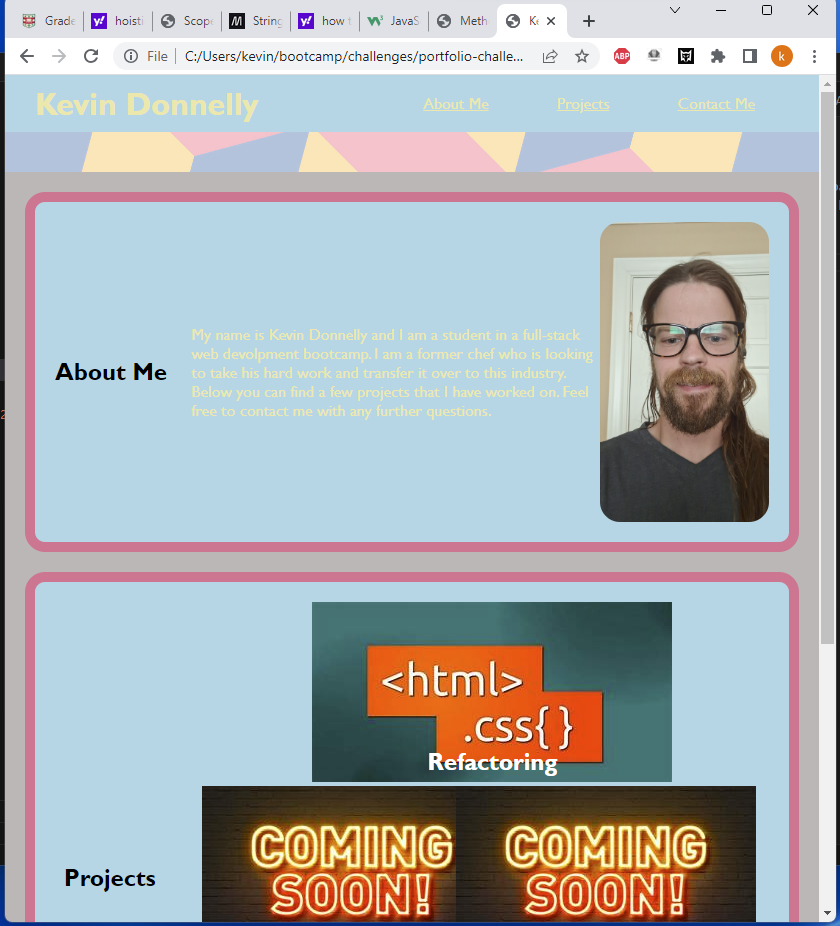
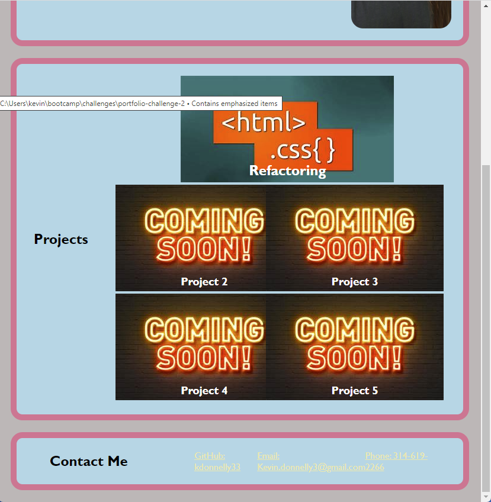

# portfolio-challenge-2
## Description
### For this project I created a Portfolio complete with links that take you to different parts of the page. I also included links to my other projects and how to contact me. I used flex box displays to lay out the page and media queries to make the page responsive.
## Screenshots
###

## Links
###
[website](https://kdonnelly33.github.io/portfolio-challenge-2/)
[repository](https://github.com/KDonnelly33/portfolio-challenge-2)